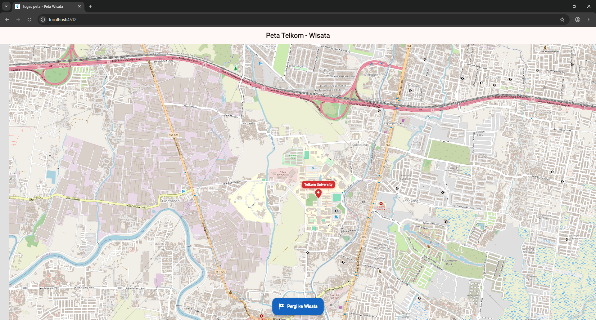
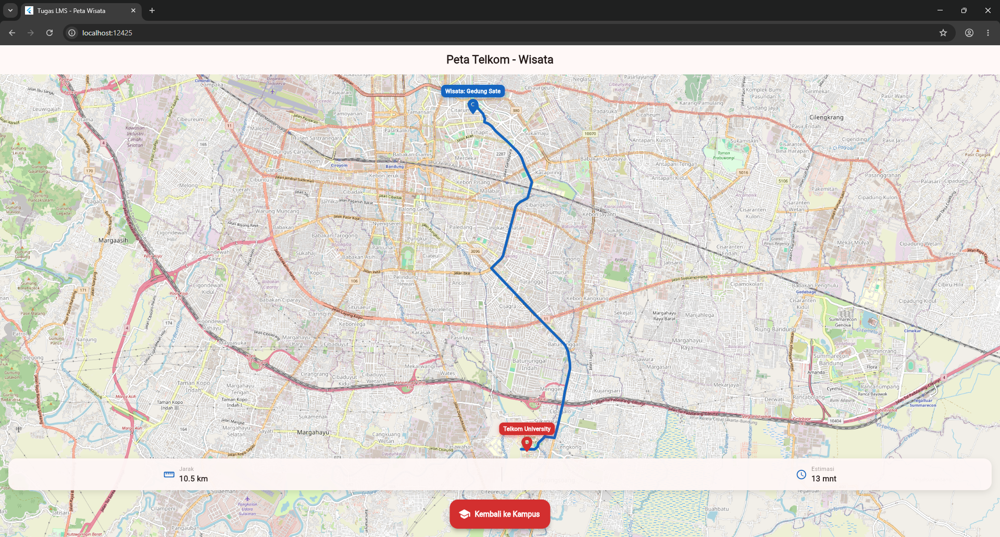

# flutter_application_1

# Tugas LMS - Peta Wisata (Flutter)

Aplikasi Flutter sederhana untuk memindahkan lokasi peta dari kampus ke tempat wisata menggunakan `flutter_map`.

## 📸 Screenshot Hasil

